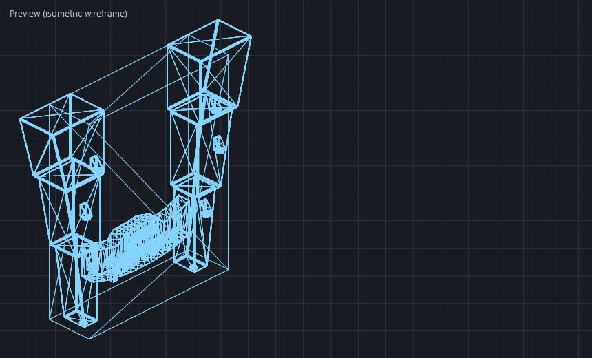

# Jurassic Beam MP V2

This repository includes the V2 update of the Jurassic Park BeamMP map package.

## Notes

- This update was assembled with AI-assisted workflow support using ChatGPT and Visual Studio Code tooling.
- The work also relied on comparing against a working map mod and using prompt engineering to track down and fix broken references.
- This release is focused on fixing and updating the mod package so it works more reliably.
- I do not take credit for building the original map.
- Credit for the original map and original assets belongs to their original creators.

## Scope Of This V2 Update

- Fixes broken texture and material path references.
- Repackages the mod as a single zip for easier use.
- Keeps the project available in a cleaner format for BeamMP/BeamNG users.

## Local Asset Pre-Flight Preview

- Use `tools/preview-beamng-asset.ps1` to preview a DAE before loading it in BeamNG.
- The tool opens a window with a mesh preview and a status label: `GOOD`, `WARN`, or `FAIL`.
- Status is based on the same checks used by `tools/validate-beamng-dae.ps1`.
- The tool also reports collision naming health (`Colmesh`/`collision` style names) so assets can be preflighted for map collision setup.
- The tool now also reports whether precise collision geometry wiring is present, not just basic collision naming.

Preview screenshot:



Example:

```powershell
.\tools\preview-beamng-asset.ps1 "unpacked/jurassic_beam_park_localfix.disabled/levels/jurassic_beam_park/art/shapes/JP_gate/jp_gate.dae"
```

Terminal-only mode:

```powershell
.\tools\preview-beamng-asset.ps1 "unpacked/jurassic_beam_park_localfix.disabled/levels/jurassic_beam_park/art/shapes/JP_gate/jp_gate.dae" -NoUi
```

Require collision mesh naming in preflight (fails with exit code 1 if missing):

```powershell
.\tools\preview-beamng-asset.ps1 "unpacked/jurassic_beam_park_localfix.disabled/levels/jurassic_beam_park/art/shapes/JP_gate/jp_gate.dae" -NoUi -RequireCollision
```

Add an exact BeamNG collision layer by cloning the visible mesh into a `Colmesh-*` geometry and node:

```powershell
.\tools\add-beamng-precise-collision.ps1 "unpacked/jurassic_beam_park_localfix.disabled/levels/jurassic_beam_park/art/shapes/JP_gate/jp_gate_frame.dae"
```

If the asset has multiple visible nodes, pass the one to clone:

```powershell
.\tools\add-beamng-precise-collision.ps1 "unpacked/jurassic_beam_park_localfix.disabled/levels/jurassic_beam_park/art/shapes/JP_gate/jp_gateDL.dae" -VisibleNodeId "JP_Gate_Door_Left"
```

Scan a folder for missing, typo-only, basic, or precise collision states:

```powershell
.\tools\add-beamng-precise-collision.ps1 "unpacked/jurassic_beam_park_localfix.disabled/levels/jurassic_beam_park/art/shapes/buildings" -Recurse -ScanOnly
```

Batch-apply precise collision only where it is still missing, while auto-fixing typoed collision nodes like `Comesh-1`:

```powershell
.\tools\add-beamng-precise-collision.ps1 "unpacked/jurassic_beam_park_localfix.disabled/levels/jurassic_beam_park/art/shapes/buildings" -Recurse -OnlyIfMissingPrecise -AutoFixTypos
```

For safety, folder mode only auto-updates simple assets with exactly one visible geometry node. Complex DAEs are reported and skipped.

## Web UI Preview (HTML)

- Open `tools/asset-preview-web.html` in a browser or a VS Code web tab.
- For the easiest user flow, run `tools/launch-asset-preview-web.bat`. It starts the local asset server and opens the browser to the web explorer.
- A profile-based launcher is included at `tools/launch-asset-preview-web.ps1` with preset profiles in `tools/asset-preview-web.profiles.json`.
- First-time setup for QoL:
	- Click `Set Default Shapes Folder` and choose your main `art/shapes` directory.
	- Optionally click `Add Custom Folder` for extra model directories.
	- Use `Refresh Sources` to rescan saved folders.
	- Pick a source and model from dropdowns.
- If you open the page from the local server, the web tab can browse assets without browser folder permissions because the page will use the `/api/models` and `/api/model` endpoints.
- `Quick Scan Folder` is still available for one-off scans without saving a source.
- You can still drop a `.dae` file (or use file picker) to get:
	- wireframe mesh preview
	- `GOOD` / `WARN` / `FAIL` status
	- geometry/triangle/vertex stats
	- collision naming check (`Colmesh` / `collision` patterns)
- The page now exposes a `ShapeEditor Handoff` panel with BeamNG-ready and workspace paths so users can search the same asset inside BeamNG's Asset Browser / Shape Editor.
- The page now includes an `Asset Tree` panel grouped by folders, so users can browse by structure instead of only the flat dropdown.
- The viewer is interactive 3D now: drag to rotate, `Shift+drag` to pan, mouse wheel to zoom.
- The page now includes `Scene Layers And Nodes` filters:
	- toggle visible/collision layers on and off
	- enable/disable specific nodes to inspect individual scene pieces
- The page now includes a `Materials And Textures` panel that reports mesh material slots, material definitions/effects, and texture paths from the DAE.
- The page now includes a `Batch Export` panel with:
	- filtered index export (`JSON` / `CSV`)
	- current preview image export (`PNG`)
- The page now includes `Beam-Ready DAE Export`:
	- injects a BeamNG-style precise collision mesh (`Colmesh-*`) for single visible-mesh DAEs
	- exports a new `*_beam_ready.dae` file
	- can preview the generated Beam-ready DAE immediately in the same web viewer
- Enable `Require collision naming` in the page to treat missing collision naming as `FAIL`.

Run the local explorer server directly:

```powershell
.\tools\asset-preview-web-server.ps1
```

Or use the launcher batch file:

```bat
tools\launch-asset-preview-web.bat
```

Launch with profile presets:

```powershell
.\tools\launch-asset-preview-web.ps1 -Preset user-friendly-default
.\tools\launch-asset-preview-web.ps1 -Preset jurassic
.\tools\launch-asset-preview-web.ps1 -Preset buildings -Port 8770
```

Batch wrapper with profile + optional overrides:

```bat
tools\launch-asset-preview-web.bat user-friendly-default
tools\launch-asset-preview-web.bat jurassic
tools\launch-asset-preview-web.bat buildings 8770
tools\launch-asset-preview-web.bat default 8765 "unpacked/jurassic_beam_park_localfix.disabled/levels/jurassic_beam_park/art/shapes" "JP_gate" "jp_gate"
```
